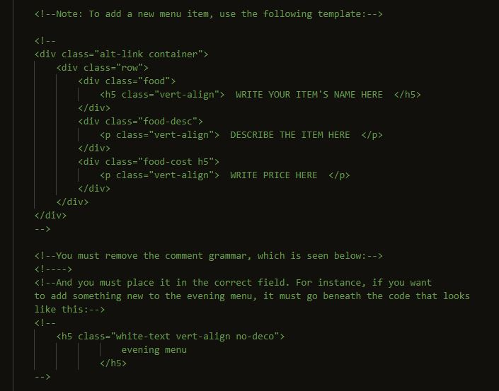
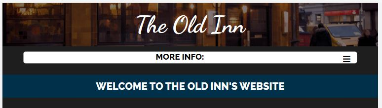
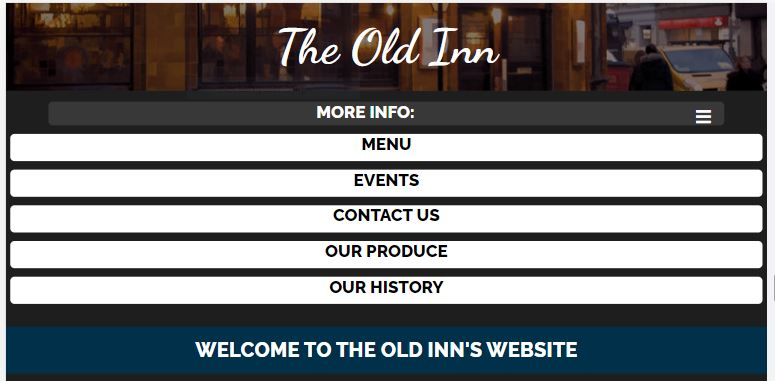
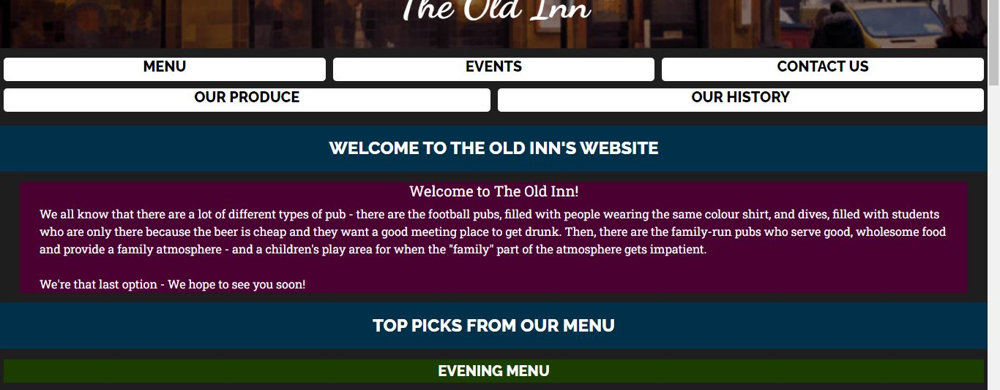

# Milestone project one - The Old Inn

The website I have built is for a pub called The Old Inn. It hopes to be easily navigable for 
prospective customers, and make information easily accessible. It contains a homepage, a menu,
a page detailing the pub's history, a "contact us" page, and pages for events and for the
pub's produce, as in: where they source their ingredients. The site will be useful for prospective
patrons of the pub, as well as the owners, who can hopefully use it to quickly update their menu 
thanks to instructional comments left in the code.

## Features

### Navigation
I included several links from one part of a page to another for easier navigation, and on the index 
page, included links to specific parts of the menu page.
I also used a burger menu for smaller screens so that the navigation items would take up less screenspace.

I used a scroll transition for these point-to-point links, though the CSS style I used to create this
effect is not compatible with certain browsers, e.g. Safari and Edge.

Features Left to Implement
I'd like to make this scroll transition compatible with all browsers using Javascript, as I know this
is possible, however at the time of writing I lack the Javascript know-how to implement this change.

### Demo
A live demo of my website can be found at this address 
"https://jameslstudent.github.io/Milestone_One/index.html"

### UX
Seeing as the website is aimed at customers for the pub, I used some complementary colours 
throughout the pages to make them warmer and more visually pleasing, but made sure that they 
were muted enough that they weren't distracting from the text or appearing unpleasant.

I wanted to give customers a solid understanding of the pub, and its ideals and values. To this end,
I included the "history" page, the "our produce" page, I wrote a brief, informative paragraph in
the homepage espousing family values, and I included a "top picks from our menu" in the homepage
as well. I wanted customers to be able to get a feel for the type of pub it tries to be from the
homepage, but to also provide more information if the customer is interested. 

## Technologies
1. HTML
2. CSS
3. Bootstrap 

## Testing
This project was developed using the mobile-first approach. Because of this, it is essential that it
work as well as possible on a mobile device. I tested this extensively, using both the Google Chrome
developer tools, and on a mobile device. While the mobile page loaded well in all cases on every mobile
device I tried (8 different mobiles in total), I rarely encountered an error in either Chrome's dev tools or 
Cloud9, where the window would load as if one of the elements were too wide for the viewport to fully 
contain, allowing for the window to scroll sideways as well as up and down. Upon further inspection, 
I found that the first time the page was inspected for a mobile view, the viewport was smaller than it 
should have been. The problem always went away when reloading the page by accessing it through 
another page's link (e.g. going into the nav bar, opening the menu page, then using the link on the 
menu page to return to the original page). Since this fix does not involve changing my own code, it leads 
me to believe that either Cloud9 gives chrome an abnormal page size on the initial "run", or Chrome's 
"inspect" tool is behind the problem, though I have looked into it and not found people experiencing 
similar issues. 

## Deployment
My website is hosted on GitHub pages, and is deployed directly from the master branch in my GitHub
repository. The site hosted on Pages automatically updates when I use git to push updates from my
local repository. You should be able to use 'git clone' the code to run it locally on your machine.

## Credits
I used "https://www.theswantytherington.co.uk/index" as a visual guide, particularly with my footer, and
also used a lot of the items on their menu for my own menu. Note that I did not use any of their code, 
only as an aesthetic reference. 

## Content
I got several pieces of code from Stack overflow, listed below.
 - vertical alignment (https://stackoverflow.com/questions/5703552/css-center-text-horizontally-and-vertically-inside-a-div-block)
 - automatic scrolling transition (https://stackoverflow.com/questions/25020582/scrolling-to-an-anchor-using-transition-css3)
 - dropdown menu (https://stackoverflow.com/questions/44832572/pure-css-clickable-dropdown)
I also used this website for colour selection:
 - https://htmlcolorcodes.com/color-picker/
I used WC3 Validator to ensure mu code was error-free: https://validator.w3.org/

## Media
The photos used in this site were obtained from google images, but their original sources follow:
 - produce-h1.jpg (https://www.msn.com/en-in/health/diet/study-fruits-and-vegetables-are-more-important-to-your-health-than-you-think/ar-AAFdZc6)
 - history-h2.jpg (https://www.shutterstock.com/search/wild+west+town+background?image_type=photo)
 - menu-h1.jpg (https://www.pinterest.co.uk/pin/534872893236514358/)
 - image-3.jpg (https://www.wattpad.com/602981015-gang-czarnych-gang-czatnych-potem-2)
 - moth-day.jpg (https://www.pinterest.co.uk/pin/36521446964196841/)
 - history-1 (http://www.peakpx.com/529129/grayscale-photography-of-australia-opera-house)
 - fath-day.jpg (https://www.facebook.com/pg/Warriorcarwashsupplies/posts/)
 - easter.jpg (https://fr.123rf.com/photo_37645448_whole-cuit-jambon-au-miel-tranch%C3%A9-%C3%A0-la-framboise-fra%C3%AEche-asperges-oeufs-teints-ester-g%C3%A2teau-de-p%C3%A2ques-et-bri.html)
 - contacts-h1.jpg (https://home.uni-leipzig.de/sprachen/wissenswertes-englisch/1125-im-portraet-englisch/)
 - christmas.png (https://scienzamagia.eu/medicina-e-benessere/mangiare-molluschi-e-pesce-fa-bene-allambiente/)
 - events-h1.jpg (https://www.gearbrain.com/smart-home-holiday-tips-2623656621.html)

## Acknowledgements
I received inspiration for this project from The New Inn at Mayshill, where I work at time of writing, because
I thought I ought to use a source material I am familiar with. I know their average customer and the type of
food they serve, and what they would want in a website.
